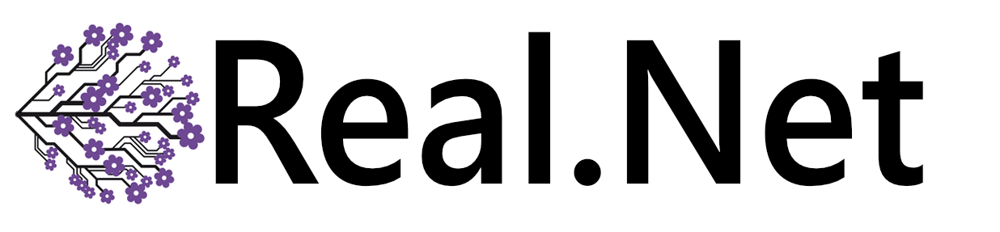

# A reactive data flow framework

**Describe your data flows in a new declarative, generic way supported by reactive programming fundamentals.**

*The core reason that prevents further abstractions of common applications is the data flow.*

Emblossom your application with **FlowRx**

## Common data flows - Overview
This overview gives an idea which modern day application requirements can be best fulfilled with FlowRx.

##

## How to customize and build your own data flows - Samples

TODO

## Design decisions

TODO

## Core Ideas and Background

TODO
What are requirements for the application data on modern applications?

With modern language features and reactive extensions a small and easy to use library shall  be created that enables writing data flows in a declarative and generic way.
Additionaly it supports the architecture idea (like mentioned in IODA) that the data itself should be the interface between application parts.
It should improve the handling of your application specific data and the corresponding dataflow.
